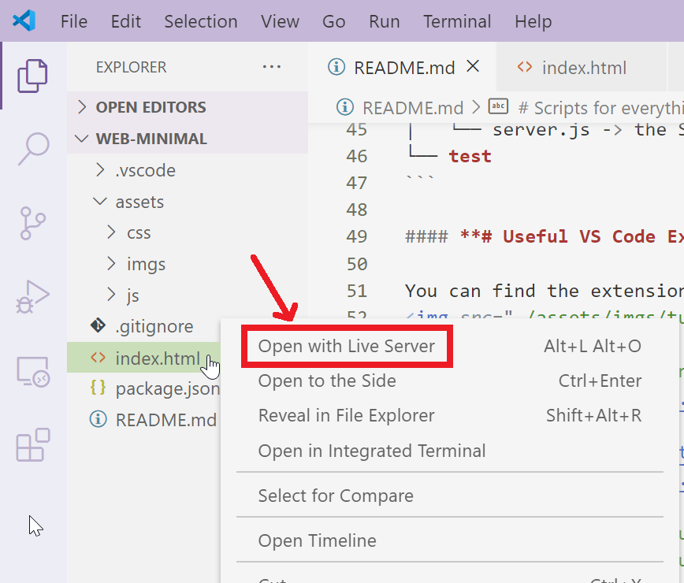

# Minimal Web Development

## **# To start with**

Clone this project into your computer:

```bash
git clone https://github.com/ecchochan/web-minimal.git
```

If you have not yet installed `Git`, read [this](https://git-scm.com/book/en/v2/Getting-Started-Installing-Git)

## **# How to view this file in VS Code**

In the upper right corner of VS Code Editor, You will find an icon with a magnifying glass, just click it to view the README.md


## **# Intsall NodeJS & npm**
```bash
wget -qO- https://raw.githubusercontent.com/creationix/nvm/v0.34.0/install.sh | bash
export NVM_DIR="$HOME/.nvm"
[ -s "$NVM_DIR/nvm.sh" ] && \. "$NVM_DIR/nvm.sh"  # This loads nvm
[ -s "$NVM_DIR/bash_completion" ] && \. "$NVM_DIR/bash_completion"  # This loads nvm bash_completion

apt-get install build-essential
nvm install 14.12.0
```

## **# Install yarn**
```bash
npm install -g yarn
```

## **# Set bash as default shell**
```bash
yarn config set script-shell /bin/bash
```

## **# File Structure**
```bash
Your Project
├── README.md      # The first page people will see in this project
├── package.json   # Config file for this project
├── Dockerfile
├── config
│   └── production.json
├── schema
│   ├── create-db.sh
│   ├── db.sql
├── scripts
│   └── deploy-production.sh 
├── src
│   ├── app -> Containes API routes
│   ├── db -> DB Models (ORM)
│   └── server.js -> the Server initlializer.
└── test
```

## **How to search in VS Code**

In the sea of components, we are easily confused when looking for components that we want, e.g. for finding their definition or where they are used. 

To make our life easier, we can use VS Code and do global search by **`Ctrl+Shift+F`** (or **`Cmd+Shift+F`** in MacOS).

Also we can enable **`Match Case`** and **`Match Whole Word`** to filter the results.

## **# Useful VS Code Extensions**

You can find the extensions here:<br/>


1. [JS & CSS Minifier (Minify)](https://marketplace.visualstudio.com/items?itemName=olback.es6-css-minify)

2. [Live Sass Compiler](https://marketplace.visualstudio.com/items?itemName=ritwickdey.live-sass)


3. [Live Server](https://marketplace.visualstudio.com/items?itemName=ritwickdey.LiveServer)



## **# Real-life practice**

This project is just a minimal setup for quick and easy get-started for beginners.

In production, we usually have more process involved, e.g. build process, webpack, etc...

You can try other start packs:

- [Bulma start](https://github.com/jgthms/bulma-start)

- [React Starter Kit](https://github.com/kriasoft/react-starter-kit)
